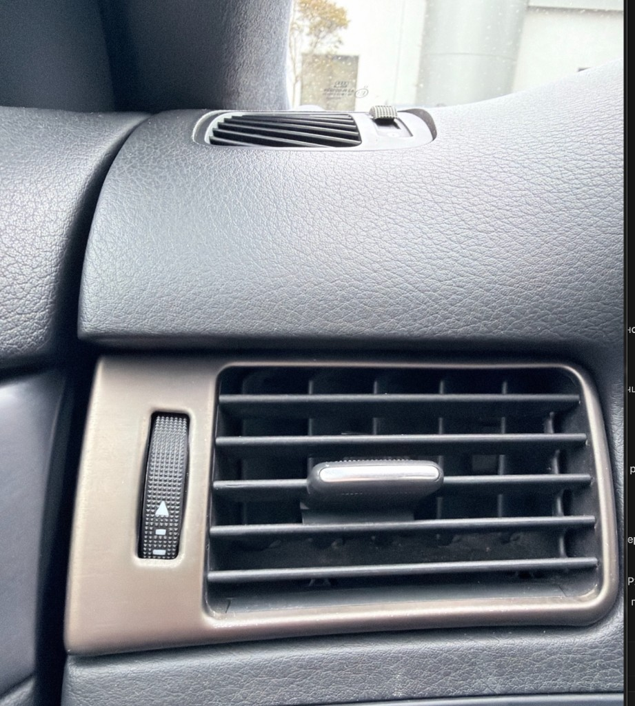

# _audi_s6 — Детали (parts list)

> Проект: [`PROJECT.md`](PROJECT.md) · Фото: [`reference/`](reference/)

---

## Референс OEM

**Что на фото:** прямоугольный дефлектор в торпедо Audi S6.  
**Цель:** заменить или перекрыть **рамку (trim surround)** карбоном. Механику оставить OEM.

| Элемент на фото | Делаем из карбона? | OEM оставляем? |
|-----------------|-------------------|----------------|
| **Trim surround** — рамка вокруг решётки (bronze/gunmetal) | **Да** — главная деталь | — |
| Горизонтальные ламели | Нет (пока) | Да |
| Слайдер L/R (хром) | Нет | Да |
| Колесо открытия потока (thumbwheel) | Нет | Да |
| Верхний полукруглый дефлектор + его рамка | **Да** — отдельная деталь | механика OEM |

---

## Группы деталей

### A — Vent trim surrounds (приоритет: с фото)

| ID | Деталь | Позиция | Qty | Статус | Notes |
|----|--------|---------|-----|--------|-------|
| `vent-main` | Прямоугольная рамка дефлектора | Dash L / R / center — уточнить | ___ | `reference` | См. фото; rounded rect, подогнать под OEM механизм |
| `vent-upper` | Рамка верхнего полукруглого дефлектора | Dash — уточнить | ___ | `planned` | Меньше, сложнее геометрия у края лобового |

**Подход:** настоящая деталь из формы — см. [`APPROACH.md`](APPROACH.md) · [`PROCESS.md`](PROCESS.md)

1. Донорская OEM рамка → **master**
2. Female mold (polyester gelcoat + iso resin + mat/cloth — FGS #16141)
3. Carbon 2x2 twill 200 g/m², vacuum bag
4. **Гибрид сзади:** carbon shell + OEM clips с донора / 3D-print mounts
5. **Satin clear** — не billboard weave, не forged carbon

### B — Door panel overlays

| ID | Деталь | Позиция | Qty | Статус |
|----|--------|---------|-----|--------|
| `door-trim` | Накладка на панель двери | FL / FR / RL / RR | 4? | `planned` |

*Уточнить: какие именно панели (armrest zone, pull handle surround, full card).*

### C — Shifter / selector surround

| ID | Деталь | Позиция | Qty | Статус |
|----|--------|---------|-----|--------|
| `shifter-trim` | Область селектора КПП | Center console | 1 | `planned` |

---

## Порядок изготовления (рекомендация)

| # | Деталь | Почему |
|---|--------|--------|
| 1 | `vent-main` (одна сторона) | Есть фото; средний размер; сразу виден результат |
| 2 | `vent-upper` | Рядом по стилю; проверить повторяемость |
| 3 | `shifter-trim` | Одна деталь, центр салона |
| 4 | `door-trim` | Больше площадь; делать после отработки finish |

---

## Не делать

| Элемент | Почему |
|---------|--------|
| Маленький ползунок внутри дефлектора | Функционал, риск ухудшить заслонки |
| Carbon skinning / плёнка | Отклонено — только molded part |
| Forged carbon | Не по эпохе C5 |
| Вертикальная вставка со слайдером | Сложнее — **после** `vent-main` |

## Finish

| | |
|---|---|
| **Weave** | 2x2 twill 200 g/m² |
| **Clear** | **Satin** 2K — OEM+/RS-style, спокойнее глянца |
| **Thickness** | ~1–1.5 mm лицо; усиление в креплениях |

---

## Открыто

- [ ] Точное кол-во `vent-main` в салоне (2? 4?)
- [ ] Снимается ли trim отдельно без всего модуля
- [ ] Фото задней стороны + `TEARDOWN.md`
- [ ] Фото дверных панелей и селектора (добавить в `reference/`)
